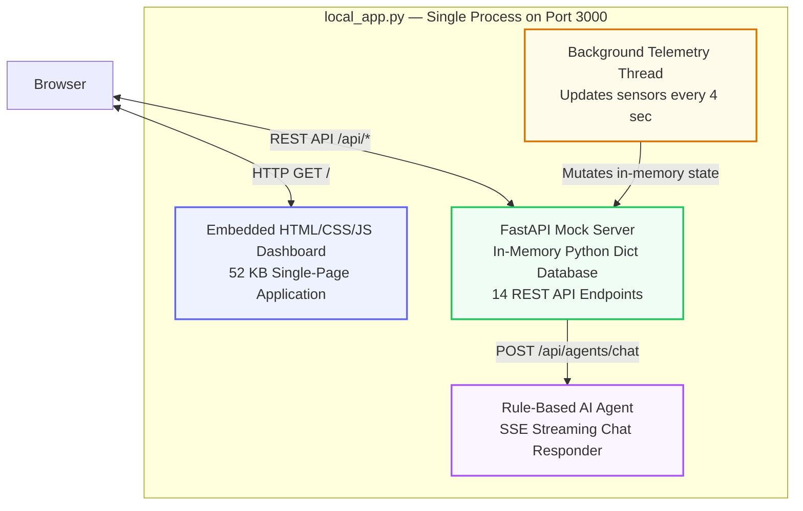
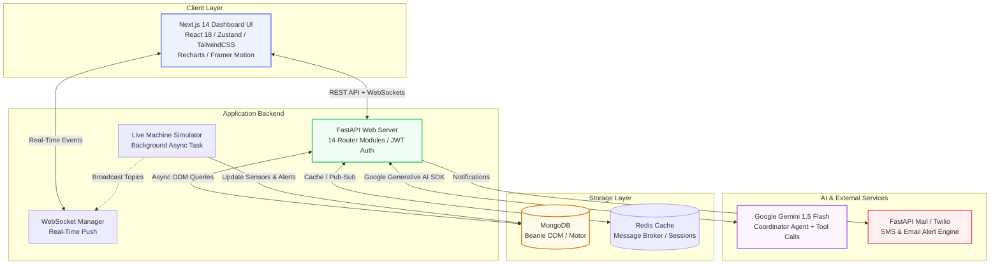

<div align="center">

# 🏭 PVCPilot AI

### Multi-Agent Manufacturing Intelligence Platform

[](https://python.org)
[](https://fastapi.tiangolo.com)
[](https://nextjs.org)
[](https://mongodb.com)
[](https://redis.io)
[](https://ai.google.dev)
[](#-running-the-test-suite)
[](LICENSE)

<br/>

> **A full-stack, AI-powered digital command centre for PVC pipe extrusion factories.**
> Unifies live machine telemetry, production scheduling, inventory, procurement,
> quality inspections, energy monitoring, financial analytics, and real-time anomaly alerts —
> all powered by a Google Gemini Coordinator Agent.

<br/>

[🚀 Quick Start](#-quick-start) · [✨ Features](#-key-features) · [🏗️ Architecture](#-system-architecture) · [📖 API Reference](#-api-reference) · [🧪 Tests](#-running-the-test-suite)

</div>

---

## 📋 Table of Contents

- [What Is This Application?](#-what-is-this-application)
- [Why Was This Built?](#-why-was-this-built)
- [Key Features](#-key-features)
- [System Architecture](#-system-architecture)
- [Directory Structure](#-directory-structure)
- [Quick Start](#-quick-start)
- [Running the Test Suite](#-running-the-test-suite)
- [Seed Accounts & Role Permissions](#-seed-accounts--role-permissions)
- [Project Technologies](#-project-technologies)
- [API Reference](#-api-reference)

---

## 🔍 What Is This Application?

**PVCPilot AI** (also referred to as *PVC Plot AI*) is a **full-stack, AI-powered Manufacturing Intelligence Platform** purpose-built for **PVC pipe extrusion factories**.

It serves as the factory's **digital command centre** — a single pane of glass that unifies:

| Domain | Capabilities |
| :--- | :--- |
| 🏗️ **Production** | Work order management, shift scheduling, live progress tracking |
| 📦 **Inventory** | Raw material stock levels, finished goods SKU tracking, reorder alerts |
| 🔧 **Machines** | Live sensor telemetry, OEE breakdown, anomaly detection |
| 🛒 **Procurement** | Purchase orders, supplier management, approval workflows |
| 🔬 **Quality** | Pipe inspections, dimensional checks, defect tracking |
| ⚡ **Energy** | Power factor monitoring, kWh consumption, load peak warnings |
| 💰 **Finance** | Cost breakdowns, profit margins, budget analysis |
| 🤖 **AI Advisory** | Gemini-powered insights, risk warnings, recommendations |

At its core sits a **Google Gemini-powered Coordinator Agent** that ingests the entire factory snapshot and returns structured markdown analyses containing **operational insights, proactive risk warnings, cross-departmental recommendations, and concrete next steps**.

> [!NOTE]
> When the Gemini API is unavailable, the platform automatically falls back to a **deterministic rule engine**, guaranteeing uninterrupted advisory service.

---

## 🎯 Why Was This Built?

Traditional PVC pipe manufacturing operations rely on fragmented spreadsheets, whiteboards, and isolated SCADA screens. PVCPilot AI was built to solve these critical pain points:

| Problem | How PVCPilot AI Solves It |
| :--- | :--- |
| 🔴 **Late fault detection** | Live background telemetry pushes temperature, vibration and pressure readings every **4 seconds**. Anomaly thresholds trigger real-time WebSocket alerts instantly. |
| 🟠 **Disconnected production tracking** | A unified Work Order queue with shift scheduling, priority tags and live progress tracking (produced vs. planned meters). |
| 🟡 **Inventory blind spots** | Raw material stock levels (K67, K57, Lead Stabilizer, CaCO3) are continuously tracked against reorder thresholds. Low-stock alerts fire automatically. |
| 🔵 **No AI decision support** | The Coordinator Agent analyses the complete system snapshot on demand and returns structured markdown with Analysis, Recommendations, Risks, and Next Steps. |
| 🟣 **Scattered reports** | One-click PDF, Excel, and CSV report generation covering production, inventory, quality, financial, and energy data. |
| ⚪ **Role confusion** | Seven pre-seeded roles (Factory Owner → Machine Operator) with granular RBAC controlling endpoint-level access. |

---

## ✨ Key Features

<details>
<summary><strong>🤖 1. AI-Powered Multi-Agent Coordinator</strong></summary>

- Uses `gemini-1.5-flash` to process complete system snapshots (inventory, machines, alerts, production, finance, and energy)
- Generates structured, professional markdown recommendations with a fallback rule engine if API limits are reached
- Streaming Server-Sent Events (SSE) deliver AI responses in real time to the chat widget

</details>

<details>
<summary><strong>📡 2. Real-Time Telemetry & Alerts</strong></summary>

- Live background worker simulates machine parameters (speed, temperature, vibration, pressure) and dynamically triggers anomaly alerts
- WebSocket broadcast engine propagates status updates to the client dashboard in real time
- Alert acknowledgement workflow with severity levels (critical, high, medium, low)

</details>

<details>
<summary><strong>🔌 3. Comprehensive Manufacturing Routers (14 API Domains)</strong></summary>

| Router | Endpoints | Description |
| :--- | :--- | :--- |
| **Dashboard** | `GET /overview` | Factory-wide KPIs, 15-day production charts, machine status grid |
| **Production** | CRUD `/work-orders` | Work order management, shift scheduling, status transitions |
| **Inventory** | `GET/POST /raw-materials` | Raw material stock levels with reorder thresholds, finished goods |
| **Machines** | `GET /sensors, /oee` | Per-extruder sensor history, OEE breakdown (A × P × Q) |
| **Procurement** | CRUD `/purchase-orders` | Purchase orders, supplier management, approval workflows |
| **Sales** | CRUD `/customer-orders` | Customer orders, dispatch scheduling |
| **Quality** | CRUD `/inspections` | Pipe inspection dimensions, defect tracking, pass/fail rates |
| **Finance** | `GET /cost-breakdown` | Cost breakdowns, profit margins |
| **Energy** | `GET /consumption` | Power factor tracking, kWh consumption logs |
| **Alerts** | `GET/PATCH /alerts` | Real-time alert log with acknowledgement, severity filtering |
| **Reports** | `POST /generate` | On-demand PDF / Excel / CSV generation |
| **Auth** | `POST /login, /register` | JWT-based authentication with bcrypt password hashing |
| **Admin** | User management | System configuration |
| **Agents** | `POST /chat` | AI Coordinator chat endpoint with SSE streaming |

</details>

<details>
<summary><strong>🎨 4. Interactive Dashboard</strong></summary>

- Built on **Next.js 14**, **TailwindCSS**, **Framer Motion**, and **Recharts** for a premium dark/light themed visual experience
- Real-time notification toast alerts, interactive machine sensor charts, and live AI chat widget
- Responsive layout with **Zustand** state management

</details>

<details>
<summary><strong>🔄 5. Flexible Startup Modes</strong></summary>

| Mode | Description | Requirements |
| :--- | :--- | :--- |
| **Mode A — Sandbox** | Run everything from a single `local_app.py` file | Python only |
| **Mode B — Distributed** | Full production-grade stack | Python, Node.js, MongoDB, Redis |

</details>

<details>
<summary><strong>🧪 6. Comprehensive Test Suite (81 Tests)</strong></summary>

- **Unit tests** for utility functions (OEE calculator, EOQ calculator, sensor anomaly detection)
- **Integration tests** for all API routers (auth, dashboard, inventory, production, machines, agents, reports)
- **Security tests** for RBAC enforcement and injection prevention

</details>

---

## 🏗️ System Architecture

### Mode A — Unified Sandbox Architecture

> The sandbox mode (`local_app.py`) bundles everything into a single Python process.



> [!TIP]
> **No external dependencies required.** Install `fastapi`, `uvicorn`, and `pydantic`, then run `python local_app.py`.

---

### Mode B — Full Distributed Architecture

> The production-grade mode uses a microservice-oriented stack.



---

## 📁 Directory Structure

<details>
<summary>Click to expand full project tree</summary>

```
PVC PLOT AI/
├── 📂 backend/
│   ├── 📂 app/
│   │   ├── 📂 agents/                 # Multi-agent AI logic
│   │   │   ├── coordinator_agent.py      # Gemini Coordinator — snapshot analysis & SSE
│   │   │   └── agent_tools.py            # Tool definitions for function-calling agents
│   │   ├── 📂 models/                 # Beanie ODM document classes
│   │   │   ├── user.py                   # User authentication model
│   │   │   ├── machine.py                # Machine, MachineLog, SensorReading
│   │   │   ├── production.py             # WorkOrder model
│   │   │   ├── inventory.py              # RawMaterial, FinishedGoods
│   │   │   ├── procurement.py            # PurchaseOrder, Supplier
│   │   │   ├── sales.py                  # CustomerOrder, Dispatch
│   │   │   ├── quality.py                # QualityInspection, Defect
│   │   │   ├── finance.py                # FinanceRecord, CostBreakdown
│   │   │   ├── energy.py                 # EnergyLog, PowerFactor
│   │   │   ├── alert.py                  # Alert with severity & acknowledgement
│   │   │   └── agent_log.py              # AgentLog — AI conversation history
│   │   ├── 📂 routers/                # FastAPI endpoint modules (14 routers)
│   │   │   ├── auth.py                   # POST /login, /register, /me
│   │   │   ├── dashboard.py              # GET /overview — KPIs, charts, machine grid
│   │   │   ├── production.py             # CRUD /work-orders, shift scheduling
│   │   │   ├── inventory.py              # GET/POST /raw-materials, /finished-goods
│   │   │   ├── machines.py               # GET /sensors, /oee, PATCH /status
│   │   │   ├── procurement.py            # CRUD /purchase-orders, /suppliers
│   │   │   ├── sales.py                  # CRUD /customer-orders
│   │   │   ├── quality.py                # CRUD /inspections, /defects
│   │   │   ├── finance.py                # GET /cost-breakdown, /margins
│   │   │   ├── energy.py                 # GET /consumption, /power-factor
│   │   │   ├── alerts.py                 # GET /alerts, PATCH /acknowledge
│   │   │   ├── reports.py                # POST /generate (PDF, Excel, CSV)
│   │   │   ├── agents.py                 # POST /chat — AI streaming endpoint
│   │   │   └── admin.py                  # User management
│   │   ├── 📂 schemas/                # Pydantic request/response schemas
│   │   ├── 📂 seed/                   # Database initialisation & 6-month simulation data
│   │   ├── 📂 services/               # Business logic services
│   │   ├── 📂 utils/                  # Utility modules
│   │   │   ├── security.py               # JWT token creation & verification, bcrypt
│   │   │   ├── oee_calculator.py         # OEE = Availability × Performance × Quality
│   │   │   ├── eoq_calculator.py         # Economic Order Quantity calculator
│   │   │   ├── mrp_calculator.py         # Material Requirements Planning calculator
│   │   │   ├── sensor_anomaly.py         # Anomaly detection for machine telemetry
│   │   │   ├── pdf_generator.py          # ReportLab-based PDF report builder
│   │   │   └── excel_generator.py        # Openpyxl-based Excel report builder
│   │   ├── 📂 websocket/              # WebSocket server & connection manager
│   │   ├── config.py                  # Settings loaded from environment variables
│   │   ├── database.py                # MongoDB connection & Beanie model init
│   │   └── main.py                    # FastAPI application startup & Live Simulator
│   ├── 📂 tests/
│   │   ├── conftest.py                # Shared test fixtures
│   │   ├── test_auth.py               # Authentication unit tests
│   │   ├── 📂 unit/                   # Unit tests (OEE, EOQ, sensor anomaly)
│   │   ├── 📂 integration/            # API integration tests (all routers)
│   │   └── 📂 security/               # RBAC & injection prevention tests
│   ├── .env.example                   # Template for environment variables
│   ├── Dockerfile                     # Backend containerisation
│   ├── pytest.ini                     # Pytest configuration
│   └── requirements.txt               # Python dependencies
├── 📂 frontend/
│   ├── 📂 app/
│   │   ├── globals.css                # TailwindCSS declarations & custom themes
│   │   ├── layout.tsx                 # Next.js root layout
│   │   ├── page.tsx                   # Main dashboard view
│   │   └── providers.tsx              # Theme & React Query providers
│   ├── 📂 components/
│   │   ├── 📂 dashboard/              # KPI cards, production charts, alert panels
│   │   ├── 📂 layout/                 # Sidebar, header, navigation
│   │   ├── 📂 machines/               # Machine cards, sensor charts, OEE gauges
│   │   └── 📂 production/             # Work order tables, shift scheduler
│   ├── 📂 hooks/
│   │   └── useWebSocket.ts            # Real-time WebSocket event subscription hook
│   ├── 📂 lib/
│   │   └── api.ts                     # Axios instance configuration
│   ├── 📂 store/                      # Zustand state stores (auth, alerts, UI, agents)
│   ├── .env.local                     # Next.js environment setup
│   ├── package.json                   # NPM dependencies & scripts
│   ├── tailwind.config.ts             # TailwindCSS theme configuration
│   └── tsconfig.json                  # TypeScript configuration
├── docker-compose.yml                 # Docker Compose for MongoDB & Redis
├── local_app.py                       # Unified development sandbox
└── README.md                          # This documentation file
```

</details>

---

## 🚀 Quick Start

You can run PVCPilot AI in two modes. **Mode A** is the quickest way to explore the platform. **Mode B** is the full production-grade setup.

### ⚡ Mode A: Lightweight Development Sandbox (Fastest)

> [!TIP]
> This mode runs the entire application from a **single command**. No MongoDB, Redis, Node.js, or Celery required.

#### Prerequisites

- Python 3.12+ installed

#### Steps

```bash
# 1. Install lightweight dependencies
pip install fastapi uvicorn pydantic

# 2. Run the sandbox server
python local_app.py

# 3. Open in your browser
# → http://localhost:3000
```

#### Login

Use any credentials from the [Seed Accounts](#-seed-accounts--role-permissions) table below.
For example: `owner@pvcpilot.com` with password `PVCPilot@2025`

#### What You Can Do in Sandbox Mode

| ✅ Feature | Description |
| :--- | :--- |
| Factory Dashboard | Live KPIs and production charts |
| Production Tab | Browse and create work orders |
| Inventory Tab | Monitor raw material & finished goods stock levels |
| Machine Sensors | Live sensor graphs (temperature, vibration, pressure) |
| Alerts | Read and acknowledge real-time alerts |
| AI Chat | Chat with the AI Coordinator Agent with streaming analysis |
| Reports | Download PDF / CSV reports |
| Finance & OEE | View cost breakdowns and OEE calculations |

---

### 🔧 Mode B: Full Distributed Stack

> Next.js + FastAPI + MongoDB + Redis + Gemini AI

#### Prerequisites

- Python 3.12+ installed
- Node.js 18+ and npm installed
- MongoDB and Redis running locally, **OR** Docker installed

---

<details>
<summary><strong>Step 1: Start Database Dependencies via Docker (Optional)</strong></summary>

If you do not have MongoDB and Redis installed natively:

```bash
docker compose up -d mongodb redis
```

</details>

---

<details>
<summary><strong>Step 2: Set Up and Run the Backend API</strong></summary>

```bash
# Navigate to backend
cd backend

# Create and activate virtual environment
# Windows (PowerShell):
python -m venv venv
.\venv\Scripts\Activate.ps1

# macOS/Linux:
python3 -m venv venv
source venv/bin/activate

# Install dependencies
pip install -r requirements.txt

# Create environment file
cp .env.example .env
# → Edit .env to set your GEMINI_API_KEY for AI agent capability

# Seed the database with 6-month simulation history
# Windows (PowerShell):
$env:PYTHONPATH="."
python app/seed/seed_data.py

# macOS/Linux:
PYTHONPATH=. python app/seed/seed_data.py

# Start the backend server
uvicorn app.main:app --reload --port 8000
```

> 📄 Swagger API docs available at: **http://localhost:8000/docs**

</details>

---

<details>
<summary><strong>Step 3: Set Up and Run the Frontend Dashboard</strong></summary>

```bash
# Open a new terminal and navigate to frontend
cd frontend

# Install Node modules
npm install

# Create .env.local with the following content:
# NEXT_PUBLIC_API_URL=http://localhost:8000/api
# NEXT_PUBLIC_WS_URL=ws://localhost:8000/ws
# NEXT_PUBLIC_APP_NAME=PVCPilot AI

# Launch the development server
npm run dev
```

> 🌐 The interactive dashboard will run on: **http://localhost:3000**

</details>

---

## 🧪 Running the Test Suite

The project includes **81 automated tests** covering unit, integration, and security concerns.

> [!NOTE]
> No running MongoDB or Redis instance is required — tests use `mongomock-motor` for in-memory database simulation.

#### Run All Tests

```bash
cd backend
$env:PYTHONPATH="."        # Windows PowerShell
pytest -v
```

#### Test Breakdown

| Category | Directory | Tests | Coverage |
| :---: | :--- | :---: | :--- |
| 🔧 **Unit** | `tests/unit/` | 18 | OEE calculator, EOQ calculator, sensor anomaly detection, password hashing |
| 🔌 **Integration** | `tests/integration/` | 48 | All 14 API routers — auth, dashboard, inventory, production, machines, agents, reports, alerts, finance, energy, procurement, quality, sales, admin |
| 🛡️ **Security** | `tests/security/` | 15 | RBAC role enforcement (GET/POST/PATCH per role), SQL/NoSQL injection prevention, XSS sanitisation |

---

## 👥 Seed Accounts & Role Permissions

> Use the common password **`PVCPilot@2025`** to authenticate with any account below.

| Email | Role | Department | Access / Permissions |
| :--- | :--- | :---: | :--- |
| `owner@pvcpilot.com` | 👑 Factory Owner | Management | Full visibility, OEE analytics, approvals, financial audit access |
| `manager@pvcpilot.com` | 🏭 Plant Manager | Production | Monitor and schedule work orders, adjust line limits, update extruder status |
| `quality@pvcpilot.com` | 🔬 Quality Engineer | Quality | Create quality inspections, pass/fail thresholds, defects reporting |
| `inventory@pvcpilot.com` | 📦 Inventory Manager | Inventory | Raw material metrics, stock-level reports, transfer audits |
| `purchase@pvcpilot.com` | 🛒 Procurement Manager | Procurement | Purchase order logs, vendor integrations, stabiliser refills |
| `sales@pvcpilot.com` | 💼 Sales Manager | Sales | Customer orders overview, dispatch scheduling |
| `operator@pvcpilot.com` | ⚙️ Machine Operator | Production | Extruder-specific speed/temperature inputs (Line 1/2) |

---

## 🛠️ Project Technologies

| Layer | Technologies |
| :--- | :--- |
| **Frontend** |       |
| **Backend** |      |
| **AI** |   |
| **Reports** |    |
| **DevOps** |    |
| **Utilities** | OEE Calculator · EOQ Calculator · MRP Calculator · Sensor Anomaly Detector |

---

## 📖 API Reference

> All sandbox endpoints are served under `http://localhost:3000/api/` and require `Authorization: Bearer dummy_token_12345` after login.

<details>
<summary><strong>View All Endpoints</strong></summary>

| Method | Endpoint | Description |
| :---: | :--- | :--- |
| `POST` | `/api/auth/login` | Authenticate and receive access token |
| `GET` | `/api/dashboard/overview` | Factory KPIs, production chart, machine statuses, top alerts |
| `GET` | `/api/production/work-orders` | List all work orders |
| `POST` | `/api/production/work-orders` | Create a new work order |
| `PATCH` | `/api/production/work-orders/{id}/status` | Update work order status |
| `GET` | `/api/inventory/raw-materials` | List raw material stock levels |
| `GET` | `/api/inventory/finished-goods` | List finished goods SKUs |
| `GET` | `/api/machines/{id}/sensors` | 30-point sensor history (temp, vibration, pressure) |
| `GET` | `/api/machines/{id}/oee` | OEE breakdown for a specific machine |
| `GET` | `/api/alerts` | List all alerts |
| `PATCH` | `/api/alerts/{id}/acknowledge` | Acknowledge an alert |
| `GET` | `/api/finance/cost-breakdown` | Factory cost breakdown by category |
| `POST` | `/api/reports/generate` | Generate a PDF/CSV report |
| `POST` | `/api/agents/chat` | AI Coordinator chat (SSE streaming response) |

</details>

---

<div align="center">

**PVCPilot AI** — *Intelligent Factory Operations, Powered by AI.* 🏭✨

</div>