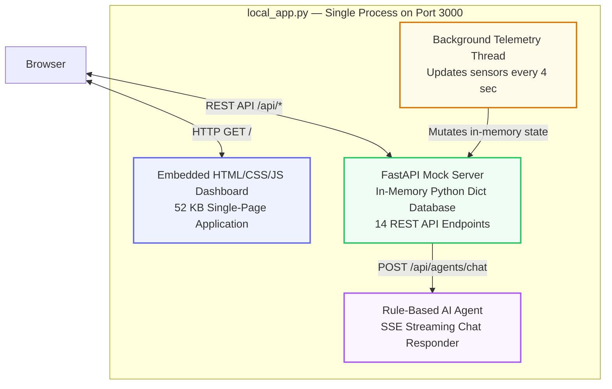
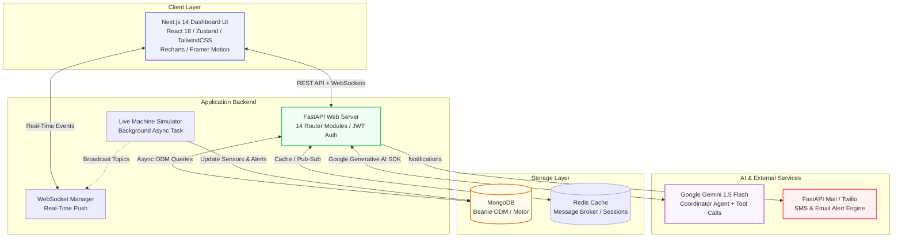

# PVCPilot AI
## Multi-Agent Manufacturing Intelligence Platform
> **Created by BMS**

---

## What Is This Application?

PVCPilot AI (also referred to as PVC Plot AI) is a **full-stack, AI-powered Manufacturing Intelligence Platform** purpose-built for **PVC pipe extrusion factories**. It serves as the factory's digital command centre — a single pane of glass that unifies live machine telemetry, production scheduling, raw-material & finished-goods inventory, procurement workflows, quality inspections, energy monitoring, financial analytics, and real-time anomaly alerts.

At its core sits a **Google Gemini-powered Coordinator Agent** that ingests the entire factory snapshot (machines, inventory, alerts, production, finance, and energy data) and returns structured markdown analyses containing **operational insights, proactive risk warnings, cross-departmental recommendations, and concrete next steps**. When the Gemini API is unavailable the platform falls back to a deterministic rule engine, guaranteeing uninterrupted advisory service.

### Why Was This Application Built?

Traditional PVC pipe manufacturing operations rely on fragmented spreadsheets, whiteboards, and isolated SCADA screens. Operators discover machine faults late, inventory shortages cause unplanned downtime, and managers lack a unified view of Overall Equipment Effectiveness (OEE). PVCPilot AI was built to solve these problems by:

| Problem | How PVCPilot AI Solves It |
| :--- | :--- |
| **Late fault detection** | Live background telemetry simulator pushes temperature, vibration and pressure readings every 4 seconds. Anomaly thresholds trigger real-time WebSocket alerts the moment a sensor exceeds safe limits. |
| **Disconnected production tracking** | A unified Work Order queue with shift scheduling, priority tags and live progress tracking (produced vs. planned meters). |
| **Inventory blind spots** | Raw material stock levels (K67, K57, Lead Stabilizer, CaCO3) are continuously tracked against reorder thresholds. Low-stock alerts fire automatically. |
| **No AI decision support** | The Coordinator Agent analyses the complete system snapshot on demand and returns structured markdown with Analysis, Recommendations, Risks, and Next Steps. |
| **Scattered reports** | One-click PDF, Excel, and CSV report generation covering production, inventory, quality, financial, and energy data. |
| **Role confusion** | Seven pre-seeded roles (Factory Owner → Machine Operator) with granular RBAC controlling endpoint-level access. |

---

## Key Features

1. **AI-Powered Multi-Agent Coordinator**
   - Uses `gemini-1.5-flash` to process complete system snapshots (inventory, machines, alerts, production, finance, and energy).
   - Generates structured, professional markdown recommendations with a fallback rule engine if API limits are reached.
   - Streaming Server-Sent Events (SSE) deliver AI responses in real time to the chat widget.

2. **Real-Time Telemetry & Alerts**
   - Live background worker simulates machine parameters (speed, temperature, vibration, pressure) and dynamically triggers anomaly alerts.
   - WebSocket broadcast engine propagates status updates to the client dashboard in real time.
   - Alert acknowledgement workflow with severity levels (critical, high, medium, low).

3. **Comprehensive Manufacturing Routers (14 API Domains)**
   - **Dashboard** — Factory-wide KPIs, 15-day production charts, machine status grid.
   - **Production** — Work order CRUD, shift scheduling, status transitions, priority management.
   - **Inventory** — Raw material stock levels with reorder thresholds, finished goods SKU tracking.
   - **Machines** — Per-extruder sensor history charts, OEE breakdown (Availability × Performance × Quality).
   - **Procurement** — Purchase orders, supplier management, approval workflows.
   - **Sales** — Customer orders, dispatch scheduling.
   - **Quality** — Pipe inspection dimensions (wall thickness, outer diameter), defect tracking, pass/fail rates.
   - **Finance** — Cost breakdowns (raw material, energy, labor, overhead, maintenance, logistics), profit margins.
   - **Energy** — Power factor tracking, load peak warnings, kWh consumption logs.
   - **Alerts** — Real-time alert log with acknowledgement, severity filtering.
   - **Reports** — On-demand PDF / Excel / CSV generation for any domain.
   - **Auth** — JWT-based authentication with bcrypt password hashing.
   - **Admin** — User management and system configuration.
   - **Agents** — AI Coordinator chat endpoint with SSE streaming.

4. **Interactive Dashboard**
   - Built on Next.js 14, TailwindCSS, Framer Motion, and Recharts for a premium dark-themed and light-themed visual experience.
   - Real-time notification toast alerts, interactive machine sensor charts, and live AI chat widget.
   - Responsive layout with Zustand state management.

5. **Flexible Startup Modes**
   - **Mode A — Sandbox**: Run the entire application from a single `local_app.py` file. No MongoDB, Redis, or Node.js required.
   - **Mode B — Distributed**: Run the full production-grade stack (Next.js + FastAPI + MongoDB + Redis + Celery).

6. **Comprehensive Test Suite (81 Tests)**
   - Unit tests for utility functions (OEE calculator, EOQ calculator, sensor anomaly detection).
   - Integration tests for all API routers (auth, dashboard, inventory, production, machines, agents, reports).
   - Security tests for RBAC enforcement and injection prevention.

---

## System Architecture

### Mode A — Unified Sandbox Architecture

The sandbox mode (`local_app.py`) bundles everything into a single Python process:



> **No external dependencies required.** Install `fastapi`, `uvicorn`, and `pydantic`, then run `python local_app.py`.

---

### Mode B — Full Distributed Architecture

The production-grade mode uses a microservice-oriented stack:



---

## Directory Structure

```
PVC PLOT AI/
├── backend/
│   ├── app/
│   │   ├── agents/                 # Multi-agent AI logic
│   │   │   ├── coordinator_agent.py    # Gemini Coordinator — system snapshot analysis & SSE streaming
│   │   │   └── agent_tools.py          # Tool definitions for function-calling agents
│   │   ├── models/                 # Beanie ODM document classes
│   │   │   ├── user.py                 # User authentication model
│   │   │   ├── machine.py              # Machine, MachineLog, SensorReading
│   │   │   ├── production.py           # WorkOrder model
│   │   │   ├── inventory.py            # RawMaterial, FinishedGoods
│   │   │   ├── procurement.py          # PurchaseOrder, Supplier
│   │   │   ├── sales.py               # CustomerOrder, Dispatch
│   │   │   ├── quality.py             # QualityInspection, Defect
│   │   │   ├── finance.py             # FinanceRecord, CostBreakdown
│   │   │   ├── energy.py              # EnergyLog, PowerFactor
│   │   │   ├── alert.py               # Alert with severity & acknowledgement
│   │   │   └── agent_log.py           # AgentLog — AI conversation history
│   │   ├── routers/                # FastAPI endpoint modules (14 routers)
│   │   │   ├── auth.py                 # POST /login, /register, /me
│   │   │   ├── dashboard.py            # GET /overview — KPIs, charts, machine grid
│   │   │   ├── production.py           # CRUD /work-orders, shift scheduling
│   │   │   ├── inventory.py            # GET/POST /raw-materials, /finished-goods
│   │   │   ├── machines.py             # GET /sensors, /oee, PATCH /status
│   │   │   ├── procurement.py          # CRUD /purchase-orders, /suppliers
│   │   │   ├── sales.py               # CRUD /customer-orders
│   │   │   ├── quality.py             # CRUD /inspections, /defects
│   │   │   ├── finance.py             # GET /cost-breakdown, /margins
│   │   │   ├── energy.py              # GET /consumption, /power-factor
│   │   │   ├── alerts.py              # GET /alerts, PATCH /acknowledge
│   │   │   ├── reports.py             # POST /generate (PDF, Excel, CSV)
│   │   │   ├── agents.py              # POST /chat — AI streaming endpoint
│   │   │   └── admin.py               # User management
│   │   ├── schemas/                # Pydantic request/response schemas
│   │   ├── seed/                   # Database initialisation & 6-month simulation data
│   │   ├── services/               # Business logic services
│   │   ├── utils/                  # Utility modules
│   │   │   ├── security.py             # JWT token creation & verification, bcrypt hashing
│   │   │   ├── oee_calculator.py       # OEE = Availability × Performance × Quality
│   │   │   ├── eoq_calculator.py       # Economic Order Quantity calculator
│   │   │   ├── mrp_calculator.py       # Material Requirements Planning calculator
│   │   │   ├── sensor_anomaly.py       # Anomaly detection thresholds for machine telemetry
│   │   │   ├── pdf_generator.py        # ReportLab-based PDF report builder
│   │   │   └── excel_generator.py      # Openpyxl-based Excel report builder
│   │   ├── websocket/              # WebSocket server & connection manager
│   │   ├── config.py              # Settings loaded from environment variables
│   │   ├── database.py            # MongoDB connection & Beanie model initialisation
│   │   └── main.py                # FastAPI application startup & Live Simulator loop
│   ├── tests/
│   │   ├── conftest.py            # Shared test fixtures (AsyncMongoMockClient, test client)
│   │   ├── test_auth.py           # Authentication unit tests
│   │   ├── unit/                  # Unit tests (OEE, EOQ, sensor anomaly)
│   │   ├── integration/           # API integration tests (all routers)
│   │   └── security/              # RBAC & injection prevention tests
│   ├── .env.example               # Template for environment variables
│   ├── Dockerfile                 # Backend containerisation
│   ├── pytest.ini                 # Pytest configuration
│   └── requirements.txt           # Python dependencies
├── frontend/
│   ├── app/
│   │   ├── globals.css            # TailwindCSS declarations & custom themes
│   │   ├── layout.tsx             # Next.js root layout
│   │   ├── page.tsx               # Main dashboard view
│   │   └── providers.tsx          # Theme & React Query providers
│   ├── components/
│   │   ├── dashboard/             # KPI cards, production charts, alert panels
│   │   ├── layout/                # Sidebar, header, navigation
│   │   ├── machines/              # Machine cards, sensor charts, OEE gauges
│   │   └── production/            # Work order tables, shift scheduler
│   ├── hooks/
│   │   └── useWebSocket.ts        # Real-time WebSocket event subscription hook
│   ├── lib/
│   │   └── api.ts                 # Axios instance configuration
│   ├── store/                     # Zustand state stores (auth, alerts, UI, agents)
│   ├── .env.local                 # Next.js environment setup
│   ├── package.json               # NPM dependencies & scripts
│   ├── tailwind.config.ts         # TailwindCSS theme configuration
│   └── tsconfig.json              # TypeScript configuration
├── docker-compose.yml             # Docker Compose for MongoDB & Redis
├── local_app.py                   # Unified development sandbox (FastAPI + HTML Mock UI)
└── README.md                      # This documentation file
```

---

## How to Access the Application

You can run PVCPilot AI in two modes. **Mode A** is the quickest way to explore the platform — it requires only Python and runs everything from a single file. **Mode B** is the production-grade setup that connects to real MongoDB and Redis instances.

### Mode A: Lightweight Development Sandbox (Fastest)

This mode runs the entire application using a single command. It hosts a mock backend with an in-memory Python dictionary database, simulates live extruder telemetry in a background thread, and serves a beautiful, self-contained 52 KB single-page HTML dashboard. **No MongoDB, Redis, Node.js, or Celery configurations are required.**

#### Prerequisites
- Python 3.12 (or higher) installed.

#### Run Steps
1. Open your terminal in the root folder of the project.
2. Install the lightweight server dependencies:
   ```bash
   pip install fastapi uvicorn pydantic
   ```
3. Run the sandbox server:
   ```bash
   python local_app.py
   ```
4. Open your browser and navigate to:
   ```
   http://localhost:3000
   ```
5. Log in using any of the credentials listed in the [Seed Accounts](#seed-accounts--role-permissions) table below (e.g. `owner@pvcpilot.com` with password `PVCPilot@2025`).

#### What You Can Do in Sandbox Mode
- ✅ View the factory dashboard with live KPIs and production charts
- ✅ Browse and create work orders in the Production tab
- ✅ Monitor raw material stock levels and finished goods in the Inventory tab
- ✅ View live sensor graphs (temperature, vibration, pressure) for any extruder
- ✅ Read and acknowledge real-time alerts (machine faults, low stock warnings)
- ✅ Chat with the AI Coordinator Agent and receive streaming markdown analysis
- ✅ Download PDF / CSV reports
- ✅ View financial cost breakdowns and OEE calculations

---

### Mode B: Full Distributed Stack (Next.js + FastAPI + MongoDB + Redis)

This mode launches the complete modular system with persistent storage and the Gemini AI integration.

#### Prerequisites
- Python 3.12 (or higher) installed.
- Node.js 18+ and npm installed.
- MongoDB and Redis installed and running locally, OR Docker installed.

---

#### Step 1: Running Database Dependencies via Docker (Optional)
If you do not have MongoDB and Redis installed natively, start them using the provided `docker-compose.yml`:
```bash
docker compose up -d mongodb redis
```

---

#### Step 2: Setting up and Running the Backend API

1. Navigate to the `backend` directory:
   ```bash
   cd backend
   ```

2. Create a virtual environment and activate it:
   - **Windows (PowerShell)**:
     ```powershell
     python -m venv venv
     .\venv\Scripts\Activate.ps1
     ```
   - **macOS/Linux**:
     ```bash
     python3 -m venv venv
     source venv/bin/activate
     ```

3. Install the Python dependencies:
   ```bash
   pip install -r requirements.txt
   ```

4. Create your `.env` file from the example:
   ```bash
   cp .env.example .env
   ```
   *Edit the `.env` file to set your actual `GEMINI_API_KEY` for AI agent capability.*

5. Seed the database with a 6-month simulation history:
   - **Windows (PowerShell)**:
     ```powershell
     $env:PYTHONPATH="."
     python app/seed/seed_data.py
     ```
   - **macOS/Linux**:
     ```bash
     PYTHONPATH=. python app/seed/seed_data.py
     ```

6. Start the FastAPI backend server:
   ```bash
   uvicorn app.main:app --reload --port 8000
   ```
   *The Swagger API documentation will be available at: http://localhost:8000/docs*

---

#### Step 3: Setting up and Running the Frontend Dashboard

1. Open a new terminal window and navigate to the `frontend` directory:
   ```bash
   cd frontend
   ```

2. Install Node modules:
   ```bash
   npm install
   ```

3. Create the environment variables file `.env.local` (ensure it aligns with the API server port):
   ```
   NEXT_PUBLIC_API_URL=http://localhost:8000/api
   NEXT_PUBLIC_WS_URL=ws://localhost:8000/ws
   NEXT_PUBLIC_APP_NAME=PVCPilot AI
   ```

4. Launch the Next.js development server:
   ```bash
   npm run dev
   ```
   *The interactive UI dashboard will run on: http://localhost:3000*

---

## Running the Test Suite

The project includes 81 automated tests covering unit, integration, and security concerns.

#### Prerequisites
- The virtual environment must be activated (see Mode B, Step 2).
- No running MongoDB or Redis instance is required — tests use `mongomock-motor` for in-memory database simulation.

#### Run All Tests
```bash
cd backend
$env:PYTHONPATH="."        # Windows PowerShell
pytest -v
```

#### Test Categories

| Category | Directory | Tests | What It Covers |
| :--- | :--- | :---: | :--- |
| **Unit** | `tests/unit/` | 18 | OEE calculator, EOQ calculator, sensor anomaly detection, password hashing |
| **Integration** | `tests/integration/` | 48 | All 14 API routers — auth, dashboard, inventory, production, machines, agents, reports, alerts, finance, energy, procurement, quality, sales, admin |
| **Security** | `tests/security/` | 15 | RBAC role enforcement (GET/POST/PATCH per role), SQL/NoSQL injection prevention, XSS sanitisation |

---

## Seed Accounts & Role Permissions

The database is seeded with different roles. Use the common password **`PVCPilot@2025`** to authenticate:

| Email | Role | Department | Access / Permissions |
| :--- | :--- | :--- | :--- |
| **`owner@pvcpilot.com`** | Factory Owner | Management | Full visibility, OEE analytics, approvals, financial audit access |
| **`manager@pvcpilot.com`** | Plant Manager | Production | Monitor and schedule work orders, adjust line limits, update extruder status |
| **`quality@pvcpilot.com`** | Quality Engineer | Quality | Create quality inspections, pass/fail thresholds, defects reporting |
| **`inventory@pvcpilot.com`** | Inventory Manager | Inventory | Raw material metrics, stock-level reports, transfer audits |
| **`purchase@pvcpilot.com`** | Procurement Manager | Procurement | Purchase orders logs, vendor integrations, stabiliser refills |
| **`sales@pvcpilot.com`** | Sales Manager | Sales | Customer orders overview, dispatch scheduling |
| **`operator@pvcpilot.com`** | Machine Operator | Production | Extruder-specific speed/temperature inputs (Line 1/2) |

---

## Project Technologies

| Layer | Technologies |
| :--- | :--- |
| **Frontend** | Next.js 14, React 18, Zustand, Axios, Recharts, Framer Motion, TailwindCSS, Lucide Icons |
| **Backend** | FastAPI, Beanie ODM (MongoDB), Motor (async MongoDB driver), WebSockets, Uvicorn, Python-jose (JWT), Bcrypt |
| **AI** | Google Gemini Generative AI SDK (`gemini-1.5-flash`), SSE streaming, function-calling tool definitions |
| **Reports** | ReportLab (PDF generation), Openpyxl (Excel exports), CSV stdlib |
| **DevOps** | Docker, Docker Compose, pytest, mongomock-motor (in-memory test DB) |
| **Utilities** | OEE Calculator, EOQ Calculator, MRP Calculator, Sensor Anomaly Detector |

---

## API Reference (Sandbox Mode)

All endpoints are served under `http://localhost:3000/api/` and accept `Authorization: Bearer dummy_token_12345` after login.

| Method | Endpoint | Description |
| :--- | :--- | :--- |
| `POST` | `/api/auth/login` | Authenticate and receive access token |
| `GET` | `/api/dashboard/overview` | Factory KPIs, production chart, machine statuses, top alerts |
| `GET` | `/api/production/work-orders` | List all work orders |
| `POST` | `/api/production/work-orders` | Create a new work order |
| `PATCH` | `/api/production/work-orders/{id}/status` | Update work order status |
| `GET` | `/api/inventory/raw-materials` | List raw material stock levels |
| `GET` | `/api/inventory/finished-goods` | List finished goods SKUs |
| `GET` | `/api/machines/{id}/sensors` | 30-point sensor history (temp, vibration, pressure) |
| `GET` | `/api/machines/{id}/oee` | OEE breakdown for a specific machine |
| `GET` | `/api/alerts` | List all alerts |
| `PATCH` | `/api/alerts/{id}/acknowledge` | Acknowledge an alert |
| `GET` | `/api/finance/cost-breakdown` | Factory cost breakdown by category |
| `POST` | `/api/reports/generate` | Generate a PDF/CSV report |
| `POST` | `/api/agents/chat` | AI Coordinator chat (SSE streaming response) |

---

*PVCPilot AI — Intelligent Factory Operations, Powered by AI.*
# PVCPilot-AI

# PVCPilot-AI

# PVCPilot-AI

# PVCPLOT-AI

# PVCPLOT-AI

# PVCPLOT-AI

